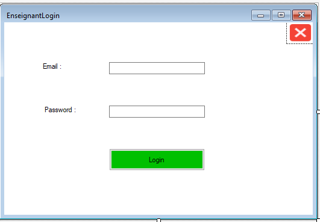
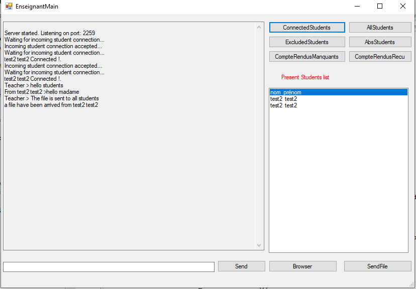
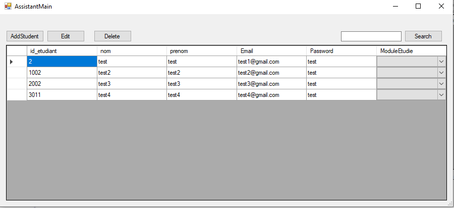
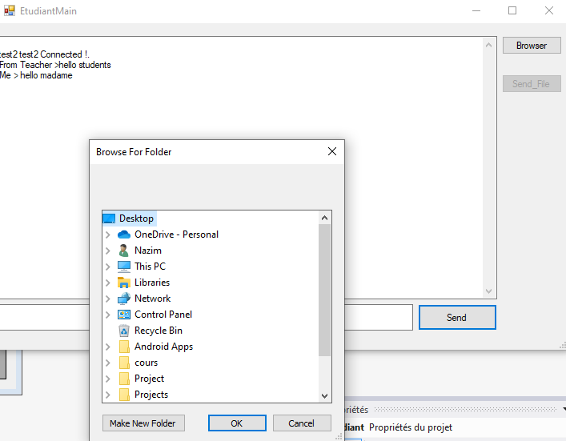

# Pedagogical Assistant System

## Project Description

This project is a system designed to enhance the management and execution of practical work sessions in an educational setting. It facilitates collaboration among students, while providing the instructor with tools to monitor and communicate with their students. The system comprises three main components:

1. **Teacher**: The teacher component allows instructors to publish practical work statements, review attendance lists, access progress reports, and communicate with students through a messaging feature.

2. **Student**: The student component enables students to submit their progress reports at the end of each practical work session, ensuring that all necessary information is captured.

3. **Pedagogical Assistant**: The pedagogical assistant component offers a chat service, accesses data from the SGBD (Système de Gestion de Base de Données), authenticates users and teachers, updates attendance and progress report receipt lists, and automatically marks students as absent after 15 minutes from the start of a session.

## Technologies Used

The following technologies are used in the development of this system:

- C#
- .NET Framework
- SQL Server
- ADO.NET
- EntityFramework
- .NET Remoting 

## Setup and Installation

To set up and install the Pedagogical Assistant System, follow these steps:

1. Clone the project repository to your local machine.
2. Open the solution file (MiniProjet.sln) in Visual Studio.
3. Restore the NuGet packages by right-clicking on the solution and selecting "Restore NuGet Packages".
4. Build the solution by clicking on the "Build" menu and selecting "Build Solution".
5. Create a database called "AssistantDB" in SQL Server.
6. Update the connection string in the `app.config` file inside the `SGBD` project with the appropriate server name, database name, and credentials.
7. Go to the ImplServices class in the SGBD project and change the value of the connectionString variable to your own connection string. The connectionString variable should look like this:
```
connectionString = "Data Source=DESKTOP-203420U\\NAZIM;Initial Catalog=AssistantDB;Integrated Security=True";
```
8. Run the application by pressing F5 or by clicking on the "Run" button in Visual Studio.

## Usage

To use the Pedagogical Assistant System, follow these steps:

1. **Teacher**:
   - Log in using your credentials.
   - Publish practical work statements for students to access.
   - Review the list of student attendances and progress reports.
   - Communicate with students through the messaging feature.

2. **Student**:
   - Log in using your credentials.
   - Submit your progress reports at the end of each practical work session.
   - Communicate with the teacher and other students through the messaging feature.

3. **Pedagogical Assistant**:
   - Log in using your credentials.
   - Access data from the SGBD.
   - Authenticate users and teachers.
   - Update attendance and progress the recived report list.
   - Automatically mark students as absent after 15 minutes from the start of a session.

## Project Structure

The system comprises three remoting applications, each with its own specific set of projects:

* **Application 1: AssistantPedagogique + Interfaces + Beans + SGBD**
    * This project contains the main forms and functionality of the system, including the login screen, the main menu, and the various forms for managing practical work statements, attendance, progress reports, and messaging.
* **Application 2: Etudiant + Interfaces + Beans**
    * This project contains the forms and functionality specific to the student role, such as submitting progress reports and communicating with the teacher.
* **Application 3: Enseignant + Interfaces + Beans**
    * This project contains the forms and functionality specific to the teacher role, such as publishing practical work statements, reviewing attendance and progress reports, and communicating with students.
 
## Database Schema


## Some Pictures

<div style="position:relative;">
  <div style="position:absolute; top:50%; left:50%; transform:translate(-50%, -50%); text-align:center; color:white; font-weight:bold; font-size:20px;">enseignant Login form </div>
  
</div>

<div style="position:relative;">
  <div style="position:absolute; top:50%; left:50%; transform:translate(-50%, -50%); text-align:center; color:white; font-weight:bold; font-size:20px;">Enseignant main form </div>
  
</div>

<div style="position:relative;">
  <div style="position:absolute; top:50%; left:50%; transform:translate(-50%, -50%); text-align:center; color:white; font-weight:bold; font-size:20px;">Add student form</div>
  
</div>

<div style="position:relative;">
  <div style="position:absolute; top:50%; left:50%; transform:translate(-50%, -50%); text-align:center; color:white; font-weight:bold; font-size:20px;">Assistant pedagogique main form</div>
  
</div>

<div style="position:relative;">
  <div style="position:absolute; top:50%; left:50%; transform:translate(-50%, -50%); text-align:center; color:white; font-weight:bold; font-size:20px;">Chose Path of a file  </div>
  
</div>

<div style="position:relative;">
  <div style="position:absolute; top:50%; left:50%; transform:translate(-50%, -50%); text-align:center; color:white; font-weight:bold; font-size:20px;">Etudiant main form </div>
  
</div>


## Contributing

If you would like to contribute to the Pedagogical Assistant System, please follow these steps:

1. Fork the project repository to your own GitHub account.
2. Create a new branch for your changes.
3. Make your changes and commit them to your branch.
4. Push your changes to your forked repository.
5. Create a pull request to the main repository.

## License

This project is licensed under the MIT license.

## Contact

If you have any questions or comments about the Pedagogical Assistant System, please feel free to contact me at [mahrougnazim@gmail.com].

